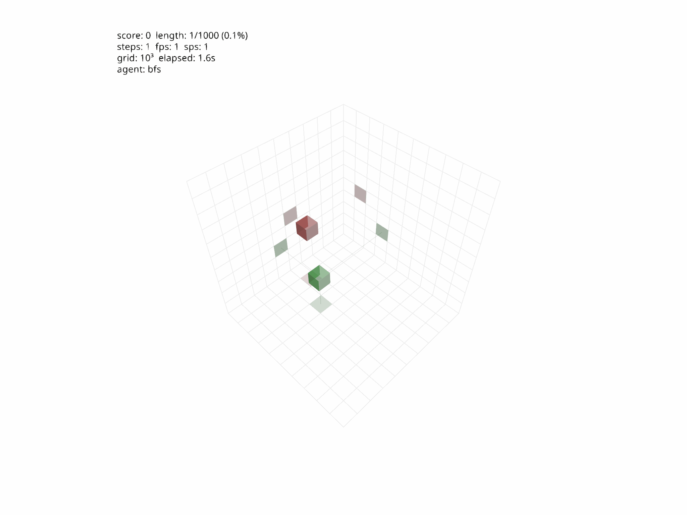
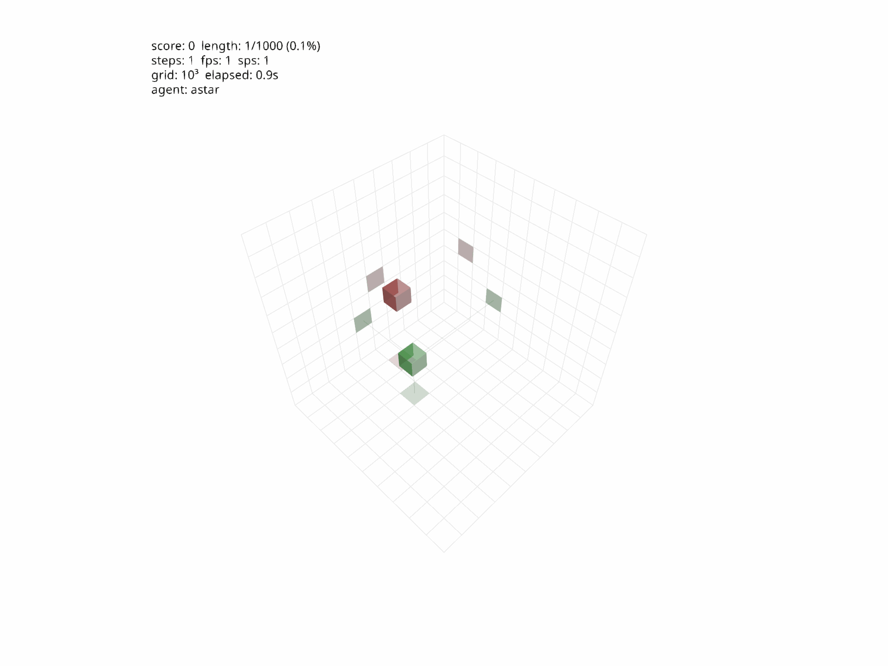

# space-snake

3D Snake in a 10×10×10 grid, powered by JAX with pygfx rendering. Includes BFS, DFS, Best-First, and A* search agents. Gymnasium-compatible environment with vmapped batching for RL training.

<p align="center">
  
  
</p>

## Quickstart

```bash
uv sync
uv run python main.py -a astar -m render
```

## Agents

| Agent | Flag | Description |
|-------|------|-------------|
| BFS | `-a bfs` | Breadth-first search |
| DFS | `-a dfs` | Depth-first search |
| Best-First | `-a best-first` | Greedy euclidean heuristic |
| A* | `-a astar` | Euclidean g-cost + manhattan h-cost |

## CLI

```
uv run python main.py [OPTIONS]

  -a, --agent     bfs | dfs | best-first | astar  (default: bfs)
  -m, --mode      headless | render                (default: headless)
  -g, --grid-num  Grid size per axis               (default: 10)
  -s, --seed      Random seed                      (default: 0)
  --max-steps     Max steps before stopping         (default: 10000)
```

## Architecture

- **`core/`** — Pure JAX game logic (`reset`, `step`), jit-compilable and vmappable
- **`env/`** — Gymnasium wrapper + vectorized batch environment
- **`agents/`** — Search-based agents operating on game state
- **`rendering/`** — pygfx 3D visualization with interactive orbit camera
